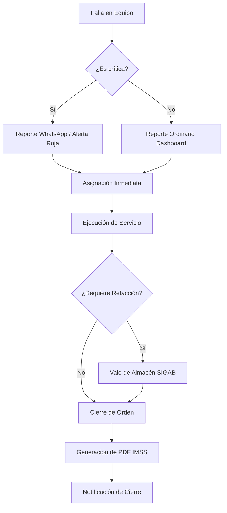
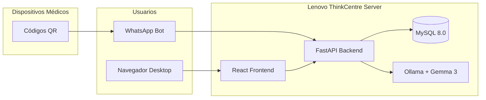
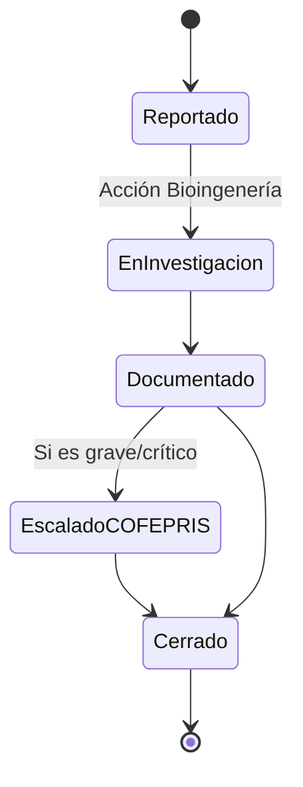

# Diagramas de Flujo y Arquitectura — SIGAB

Este documento recopila los diagramas lógicos y de flujo que rigen el sistema SIGAB en el HGR No. 1.

## 1. Flujo Operativo de Ingeniería Clínica
Este diagrama describe cómo una falla se convierte en un ticket y cómo el bot interviene.

## 2. Diagrama de Implementación On-Premise (Arquitectura)
Estructura de hardware y software local.

## 3. Ciclo de Vida de Tecnovigilancia (NOM-240)
Gestión de eventos adversos.

