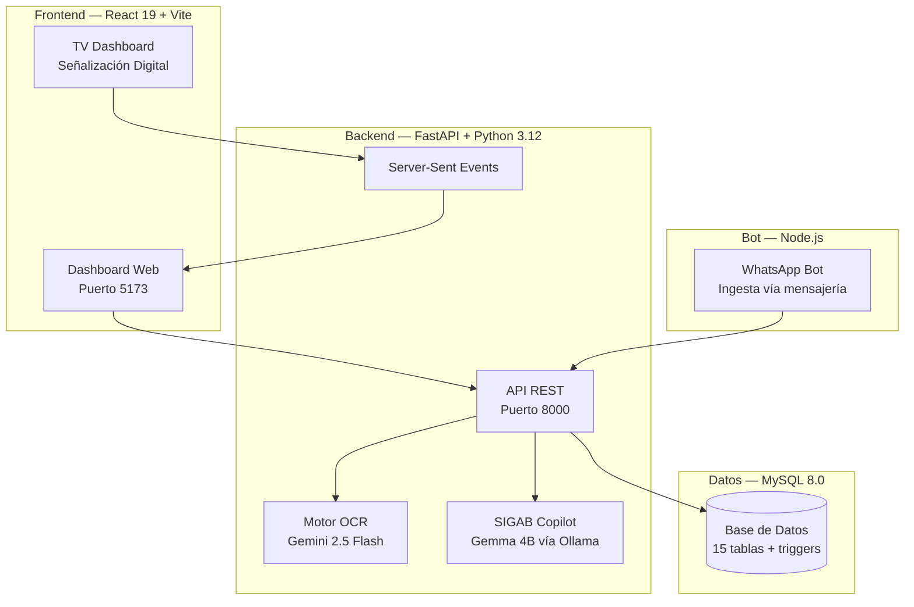

# SIGAB — Sistema Integral de Gestión de Activos Biomédicos

[]()
[]()
[]()
[]()

---

## Descripción

**SIGAB** es una plataforma digital **100% On-Premise** diseñada para hospitales públicos mexicanos que automatiza la gestión de activos biomédicos. Proporciona trazabilidad en tiempo real, órdenes de servicio digitales, mantenimiento preventivo, tecnovigilancia NOM-240 y un copiloto de IA local.

**Sitio piloto:** Hospital General Regional No. 1, IMSS — Tijuana, B.C., México.

### Problema que resuelve

| Métrica | Antes (papel) | Con SIGAB |
|---------|---------------|-----------|
| Tiempo búsqueda de equipo | 15-30 min | < 5 seg (QR) |
| Registro de orden de servicio | 45-90 min | < 2 min (OCR/IA) |
| Preventivos retrasados | 90% | < 5% |
| Trazabilidad auditable | Inexistente | ISO 8601 + SHA-256 |

---

## Arquitectura del Sistema



---

## Estructura del Proyecto

```
SIGAB/
├── README.md                  # Este archivo
├── CLAUDE.md                  # Contexto para Claude Code
├── docker-compose.yml         # Orquestación de contenedores
├── .gitignore
│
├── sigab-backend/             # ⚙️ API REST (FastAPI + Python 3.12)
│   ├── main.py                #    Punto de entrada y registro de routers
│   ├── config.py              #    Variables de configuración
│   ├── database.py            #    Conexión y sesiones MySQL
│   ├── auth/                  #    Autenticación JWT
│   ├── models/                #    Modelos SQLModel / Pydantic
│   ├── routes/                #    Endpoints agrupados por módulo
│   ├── services/              #    Lógica de negocio (PDF, OCR, IA, etc.)
│   └── utils/                 #    Utilidades (ISO 8601, helpers)
│
├── sigab-frontend/            # 🎨 Dashboard Web (React 19 + Vite + Tailwind)
│   └── src/
│       ├── api/               #    Cliente HTTP centralizado (Axios)
│       ├── components/        #    Componentes reutilizables
│       ├── context/           #    Contexto de autenticación
│       ├── hooks/             #    Hooks custom (SSE, Dashboard, Responsive)
│       ├── pages/             #    Páginas del sistema (19 módulos)
│       └── utils/             #    Constantes, tokens de diseño
│
├── sigab-bot/                 # 🤖 Bot de WhatsApp (Node.js)
│   ├── index.js               #    Servidor principal del bot
│   ├── commands.js            #    Handlers de comandos
│   └── scheduler.js           #    Tareas programadas
│
├── database/                  # 🗄️ Esquemas SQL y migraciones
│   ├── sigab_schema.sql       #    Esquema de producción
│   ├── sigab_schema_fresh.sql #    Esquema limpio (nuevas instalaciones)
│   ├── seed_data.sql          #    Datos semilla para demo
│   └── migrations/            #    Migraciones incrementales (004-010)
│
├── scripts/                   # 🔧 Scripts de utilidad
│   ├── start_sigab.sh         #    Arranque completo (Linux/WSL2)
│   ├── start_sigab.ps1        #    Arranque completo (Windows)
│   ├── stop_sigab.sh          #    Detención (Linux/WSL2)
│   ├── stop_sigab.ps1         #    Detención (Windows)
│   ├── init_db.sh             #    Inicialización de base de datos
│   └── fix_db.sh              #    Corrección de esquema
│
├── docs/                      # 📚 Documentación completa
│   ├── arquitectura/          #    Diagramas de flujo, organigramas
│   ├── negocio/               #    Plan maestro, estrategia financiera
│   ├── estudios_tecnicos/     #    Secciones 3.1-3.6 del estudio técnico
│   ├── estudios_economicos/   #    Costos, inversión, VPN/TIR/TMAR
│   ├── operacion/             #    Planes de instalación y go-live
│   ├── presentaciones/        #    PDF/PPTX ejecutivos + slides
│   └── api/                   #    Referencia de endpoints
│
└── logs/                      # 📋 Logs de ejecución (git-ignored)
```

---

## Stack Tecnológico

| Capa | Tecnología | Versión |
|------|-----------|---------|
| **Frontend** | React + Vite + Tailwind CSS | 19 / 5 / 3 |
| **Backend** | FastAPI + Uvicorn | Python 3.12 |
| **Base de Datos** | MySQL | 8.0 |
| **OCR / Visión** | Google Gemini Flash | 2.5 |
| **IA Local** | Gemma vía Ollama | 4B |
| **Bot** | Node.js (whatsapp-web.js) | 18+ |
| **QR** | Segno (nivel H, 30% recuperación) | — |
| **Servidor** | Lenovo ThinkCentre M720q, WSL2 Ubuntu 24.04 | — |

---

## Instalación Rápida

### Prerrequisitos

- **Python** 3.12+
- **Node.js** 18+
- **MySQL** 8.0 (Docker o local)
- Git

### 1. Clonar el repositorio

```bash
git clone https://github.com/tu-org/SIGAB.git
cd SIGAB
```

### 2. Base de datos

```bash
# Opción A: Docker
docker compose up -d mysql

# Opción B: MySQL local
mysql -u root -p < database/sigab_schema_fresh.sql
mysql -u root -p sigab_prod < database/seed_data.sql
```

### 3. Backend

```bash
cd sigab-backend
python -m venv venv
source venv/bin/activate        # Linux/Mac
# .\venv\Scripts\Activate.ps1  # Windows
pip install -r requirements.txt
uvicorn main:app --host 0.0.0.0 --port 8000 --reload
```

### 4. Frontend

```bash
cd sigab-frontend
npm install
npm run dev
```

### 5. Acceder

- **Dashboard:** http://localhost:5173
- **API Docs:** http://localhost:8000/docs
- **TV Dashboard:** http://localhost:5173/tv

### Credenciales Demo

| Matrícula | Contraseña | Rol |
|-----------|-----------|-----|
| `ADMIN001` | `sigab_admin_2026` | Administrador |
| `99024980` | `sigab_admin_2026` | Jefe de Conservación |

---

## Módulos del Sistema

| # | Módulo | Ruta | Descripción |
|---|--------|------|-------------|
| 1 | Dashboard | `/` | KPIs en tiempo real + mapa interactivo |
| 2 | Analítica Predictiva | `/analitica` | MTBF/MTTR, probabilidad de falla |
| 3 | Equipos | `/equipos` | CRUD de activos biomédicos |
| 4 | Órdenes de Servicio | `/ordenes` | Gestión de correctivos/preventivos |
| 5 | Trazabilidad | `/trazabilidad` | Historial de movimientos NOM-016 |
| 6 | Preventivos | `/preventivos` | Calendario de mantenimiento |
| 7 | Alertas | `/alertas` | Notificaciones del sistema |
| 8 | Reportes | `/reportes` | PDF/Excel diario e historial |
| 9 | Almacén | `/almacen` | Stock de refacciones |
| 10 | Metrología | `/metrologia` | Calibración de instrumentos |
| 11 | Capacitaciones | `/capacitaciones` | Registro de formación NOM-016 |
| 12 | Lote QR | `/qrbatch` | Impresión masiva de etiquetas |
| 13 | Tecnovigilancia | `/tecnovigilancia` | Eventos adversos NOM-240 |
| 14 | Copilot IA | `/copilot` | Asistente de diagnóstico (Gemma) |
| 15 | Auditoría | `/auditoria` | Log SHA-256 encadenado |
| 16 | Compliance | `/checklists` | Checklists NOM-016 |

---

## Normativa Cumplida

- **NOM-016-SSA3-2012** — Funcionamiento de hospitales: trazabilidad, auditoría
- **NOM-240-SSA1-2012** — Tecnovigilancia: reporte de eventos adversos
- **ISO 13485** — Sistemas de gestión de calidad para dispositivos médicos
- **ISO 8601** — Formato de fechas y horas (folios SIGAB-HGR1-YYYYMMDD-HHMM-NNNN)
- **LFPDPPP** — Privacidad de datos (On-Premise, datos no salen del hospital)

---

## Convenciones de Desarrollo

- **Idioma UI:** Español mexicano
- **Notificaciones:** `toast.success/error/loading` (react-hot-toast)
- **Colores de estado:** `emerald` = operativo, `amber` = mantenimiento, `red` = fuera_servicio, `slate` = baja
- **Máquinas de estado:** Dict `TRANSICIONES` en backend
- **Audit trail:** Tabla `log_actividad` con hashing SHA-256 encadenado

---

## Equipo

| Nombre | Rol |
|--------|-----|
| Gustavo López Carballo | Líder técnico / Arquitecto |
| Fernando Domínguez | Desarrollo / Infraestructura |
| Salvador Soltero | Desarrollo / QA |

**Institución:** Centro de Estudios Universitarios Xochicalco — Campus Tijuana  
**Carrera:** Bioingeniería en Procesos de Manufactura  
**Materia:** Integración Empresarial  

---

## Licencia

Proyecto académico con derechos reservados. © 2025-2026 Equipo SIGAB.
