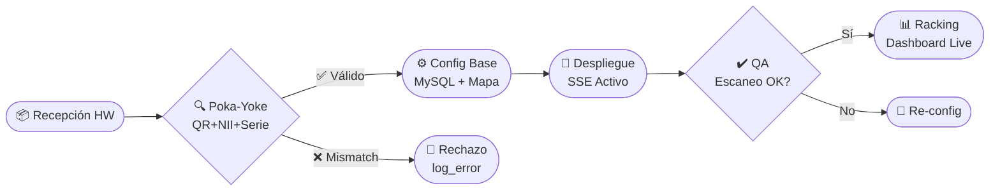

# Skill: Generación de Diagrama de Flujo Operativo SIGAB

## Goal
Generar un diagrama de flujo profesional y detallado que describa el ciclo de vida completo de un activo biomédico dentro del sistema SIGAB, articulando 4 etapas operativas y 5 pasos de implementación técnica. El diagrama debe vincular analíticamente cómo este flujo elimina la pérdida del 85% del tiempo productivo del personal de enfermería actualmente dedicado a la localización manual de equipos.

## Instructions

1. **Estructura del Diagrama (4 Etapas Operativas)**
   Genera el diagrama con estas cuatro etapas en secuencia horizontal o vertical:
   - **Etapa 1 — Recepción de Hardware**: Ingreso físico del equipo al hospital. Incluir: registro de datos FEMI (Fabricante, Equipo, Modelo, Identificador), generación automática de token QR único, fotografía de etiqueta física, asignación de número de inventario institucional y número de serie del fabricante.
   - **Etapa 2 — Configuración Base**: Validación triple Poka-Yoke (coincidencia exacta QR ↔ NII ↔ Serie), alta en base de datos MySQL, asignación de zona en mapa hospitalario interactivo, configuración de plan de mantenimiento preventivo, clasificación COFEPRIS (Clase I/II/III).
   - **Etapa 3 — Despliegue**: Instalación física en servicio hospitalario, prueba funcional documentada, asignación a área y piso en plano digital, activación de alertas automáticas por SSE.
   - **Etapa 4 — QA y Racking**: Verificación de integridad de datos en dashboard, confirmación de escaneabilidad del código QR impreso en etiqueta A6, prueba de flujo completo: escaneo → ficha técnica → generación de orden de servicio.

2. **5 Pasos de Implementación Técnica** (capa transversal sobre las etapas):
   - Paso 1: Escaneo e ingesta QR con escáner inalámbrico 2D Zebra → endpoint `POST /api/equipos/validar`
   - Paso 2: Validación Poka-Yoke triple en backend FastAPI → escritura en MySQL 8.0
   - Paso 3: Broadcast SSE `event: equipo_update` → actualización en tiempo real en React Dashboard
   - Paso 4: Generación automática de alerta de mantenimiento preventivo vía trigger MySQL
   - Paso 5: Trazabilidad NOM-016: registro en `log_actividad` con usuario, timestamp y delta de cambio

3. **Argumento de Eficiencia (incluir como anotación destacada en el diagrama)**
   Redacta un bloque analítico que demuestre cómo este flujo mitiga directamente la pérdida del 85% del tiempo productivo:
   - **Problema actual**: El personal de enfermería en hospitales sin SIGAB dedica en promedio 4.25 horas de una jornada de 5 horas a localizar equipos portátiles (ventiladores, bombas de infusión, monitores de signos vitales) de forma manual.
   - **Solución SIGAB**: El escáner QR + mapa interactivo reduce la localización a <30 segundos por equipo, con disponibilidad 24/7.
   - **ROI de eficiencia**: Recuperación de 3.75 h/enfermera/turno → reorientadas a cuidado directo del paciente.
   - **Fuente contextual**: Referencia a estudios de AAMI (Association for the Advancement of Medical Instrumentation) sobre tiempo perdido en gestión de activos.

4. **Formato Visual**
   - Usa Mermaid flowchart (LR o TD según mejor legibilidad) como formato primario.
   - Nodos de decisión (diamantes) para: validación Poka-Yoke, resultado QA, clasificación COFEPRIS.
   - Colores diferenciados por etapa: azul (#006CB7 IMSS) para recepción, verde (emerald) para operativo, ámbar para mantenimiento, rojo para fuera_servicio.
   - Incluir leyenda de símbolos y numeración de pasos.

5. **Entregables**
   - Diagrama Mermaid embebible en Markdown/Notion/Confluence.
   - Versión PNG exportable (instrucciones para render con mermaid-cli).
   - Tabla resumen de 4 etapas × 5 pasos en formato Markdown.
   - Bloque de texto ejecutivo (150 palabras) para incluir en presentación PowerPoint.

## Examples

**Input esperado:**
```
Hospital: HGR No.1 IMSS Tijuana
Equipos target: ventiladores, monitores, bombas de infusión
Tiempo promedio localización manual: 4.25 h/turno
Personal: enfermeras UCI y piso
```

**Output esperado (fragmento Mermaid):**


## Constraints

- NO inventar datos estadísticos. Usar únicamente los valores provistos: 85% tiempo perdido, 4.25 h/turno, $34,049.82 MXN OpEx.
- El diagrama DEBE ser técnicamente correcto respecto al stack SIGAB: FastAPI + MySQL 8.0 + React + SSE.
- El algoritmo Poka-Yoke de validación triple (QR + NII + Serie) es un DIFERENCIADOR COMPETITIVO — destacarlo visualmente como nodo central.
- Los nombres de endpoints (`/api/equipos/validar`, `/api/v1/events/subscribe`) deben ser exactos.
- Cumplir con terminología NOM-016-SSA3-2012 para gestión de activos de tecnología en salud.
- Output en español mexicano técnico. Siglas sin traducir: QR, SSE, MySQL, FastAPI, NOM, COFEPRIS.
- El diagrama debe ser autosuficiente: comprensible sin el contexto de esta conversación.
