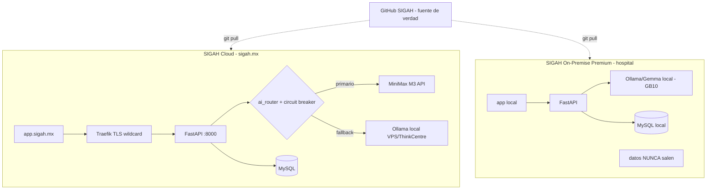

# SIGAH × MiniMax — Workflow maestro (plan ejecutable, documentado y listo)

> Generado por workflow multi-agente (Opus 4.8) el 2026-06-01 para Gustavo.
> Goal asociado: `all tests pass`. Estado: plan **preparado y documentado**; ejecución se activa al contratar MiniMax.
>
> Documentos de soporte (misma carpeta):
> - `01-MINIMAX-PLAN-Y-API.md` — qué plan contratar + API M3
> - `02-VIDEO-ANALISIS.md` — el video y cómo aplica
> - `03-DESPLIEGUE-DOMINIO-24-7.md` — dominio `.mx`, TLS, 24/7, dos ediciones
> - `04-TESTS-BASELINE-Y-FIX.md` — goal `all tests pass`
> - `05-INTEGRACION-MINIMAX-CODIGO.md` — capa de código (router + fallback)
> - `06-AUDITORIA-ECOSISTEMA.md` — mapa del ecosistema y flujo de datos

---

## 1. TL;DR ejecutivo (decisiones)

| Tema | Recomendación | Costo |
|---|---|---|
| **Plan MiniMax (desarrollo)** | Contratar **Max $44/mo** hoy (4-5 agentes concurrentes; Plus se satura con multi-agente) | ~$44 USD/mo |
| **IA en producción (Cloud)** | **NO** usar la suscripción; usar **API Pay-as-You-Go** (`sk-api`, OpenAI-compatible) | ~$5-7.5 USD/hospital/mes |
| **Agentes para construir SIGAH** | Redirigir `ANTHROPIC_BASE_URL` de Claude Code → `https://api.minimax.io/anthropic` (del video) | dentro del plan Max |
| **Dominio** | Comprar **`sigah.mx`** (Akky/NIC México ~$600-900 MXN/año) + DNS en Cloudflare (gratis) | ~$700 MXN/año |
| **TLS** | Traefik + Let's Encrypt **DNS-01 (Cloudflare)** → wildcard `*.sigah.mx` | $0 |
| **Datos clínicos (PHI)** | De-identificar antes de salir a nube; lo sensible al **modelo local**; DPA con residencia fuera de China | — |
| **Resiliencia** | Circuit breaker nube↔local; UPS + `restart: always` + healthchecks (ya presentes) | — |

**La suscripción y el API son productos separados que se facturan aparte.** Suscripción = herramienta de desarrollo (se agota). API = motor de producción escalable (por token). Esta es la confusión #1 a evitar.

---

## 2. Las dos ediciones de SIGAH (modelo de negocio)

| | **SIGAH Cloud / Plan A** (~$100k MXN inicial) | **SIGAH On-Premise Premium** |
|---|---|---|
| Cerebro IA | MiniMax **M3 API** (nube) + fallback Ollama | **Ollama/Gemma local**, nunca sale a la nube |
| Datos | en nube (PHI de-identificado) | 100% dentro del hospital |
| Hardware | VPS/nube | ThinkCentre → futura máquina **GB10 NVIDIA** |
| Si se cae luz/nube | degrada a LLM + datos locales | sigue operando local |
| Funciones núcleo | inventario + bitácoras + servicio + pistola láser + escáner + catálogo de refacciones | igual + soberanía de datos |
| `SIGAH_LLM_PROVIDER` | `minimax` | `ollama` |

> Misma base de código, **una sola imagen Docker**; la edición se elige por variable de entorno (ver doc 05). Esto es clave: no mantienes dos productos, mantienes uno configurable.

---

## 3. Costo y margen de la edición Cloud (por hospital)
- API M3: ~$5-7.5 USD/mes/hospital (supuestos de Copilot+OpenClaw, con cache read $0.12/M abaratando mucho).
- A 17.5 MXN/USD ≈ **$90-131 MXN/mes** → **<0.15%** del ticket inicial de ~$100k MXN.
- **Sugerencia comercial:** cobrar una mensualidad de servicio con buffer 3-5× sobre el costo IA real para cubrir soporte, hosting y margen.

---

## 4. Arquitectura objetivo (24/7, dos ediciones)

---

## 5. Plan por fases (accionable, con criterios de hecho)

### Fase 0 — Consolidar (antes de tocar nada)
- [ ] Consolidar los **12 worktrees** y los cambios sin commitear (riesgo de divergencia, doc 06).
- [ ] Añadir **CI de tests** (`.github/workflows/tests.yml` con MySQL service + pytest). *Hecho cuando un PR corre pytest verde automáticamente.*

### Fase 1 — Goal `all tests pass`
- [ ] Aplicar `conftest-tenant-fix.patch` en la rama de los tests (coordinar con worktree `fix-tenant-tests-session`).
- [ ] Aplicar **Opción A** del doc 04: pasar `session=` a `AuditService.log_event` en routers mutadores. *Hecho cuando `pytest tests/` = 18 passed, 1 xfailed, 0 fail.*

### Fase 2 — Dominio + TLS (doc 03)
- [ ] Comprar `sigah.mx`, DNS a Cloudflare, registros A → 129.121.100.147.
- [ ] Traefik DNS-01 Cloudflare → wildcard `*.sigah.mx`; subdominios `app./api./panel./www.`.
- [ ] Migrar de sslip.io **sin downtime** (añadir hosts nuevos a labels conservando los viejos; regla 502). *Hecho cuando `https://app.sigah.mx` carga con candado verde.*

### Fase 3 — Hardening de autenticación (doc 03)
- [ ] Secreto JWT fuerte/rotable, access TTL 15-30 min, revocación de refresh, 2FA TOTP para admin/CEO.
- [ ] **Cerrar `/api/openclaw` también en Traefik** (hoy solo nginx interno; hay endpoints sin JWT). *Hecho cuando `/api/openclaw/*` (salvo bot-login) responde 401/403 desde fuera.*

### Fase 4 — Integración MiniMax (docs 01 + 05)
- [ ] Contratar **Max** y configurar Claude Code dev (`ANTHROPIC_BASE_URL`).
- [ ] Crear `services/minimax_service.py` + `services/llm_service.py` (router + circuit breaker + fallback).
- [ ] Migrar `routes/copilot.py` y `routes/openclaw.py` a `llm_service`.
- [ ] Tests con mocks (sin API key). *Hecho cuando los tests de `llm_service` pasan y `SIGAH_LLM_PROVIDER=ollama` no cambia comportamiento actual.*
- [ ] Crear `sk-api` Pay-as-You-Go y activar `SIGAH_LLM_PROVIDER=minimax` en la edición Cloud.

### Fase 5 — HA + empaquetar On-Premise (doc 03)
- [ ] Backups MySQL 3-2-1 con restore probado + volúmenes `sigab_uploads`/`sigab_bot_auth`.
- [ ] Monitoreo activo `sigab-monitor` + `/api/monitor/status` con alertas; runbook (incluye `docker restart traefik`).
- [ ] Imagen/instalador On-Premise Premium con Ollama embebido. *Hecho cuando un hospital sin internet opera 24/7 con su LLM local.*

### Fase 6 — Cumplimiento (docs 01 + 05)
- [ ] De-identificación de PHI antes de salir a nube; DPA con MiniMax (residencia fuera de China); aviso de privacidad LFPDPPP. *Hecho cuando un revisor confirma que ningún dato identificable de paciente sale a la nube.*

---

## 6. Riesgos abiertos (decisiones que requieren tu visto bueno)
1. **PHI a la nube** vs sello "100% on-premise" — la edición Cloud necesita postura de cumplimiento clara (de-identificar / contrato / aviso).
2. **Consolidación de worktrees** — 12 ramas paralelas; conviene ordenar antes de la integración.
3. **Dónde aterriza el fix de tests** — coordinar con `fix-tenant-tests-session` para no duplicar.
