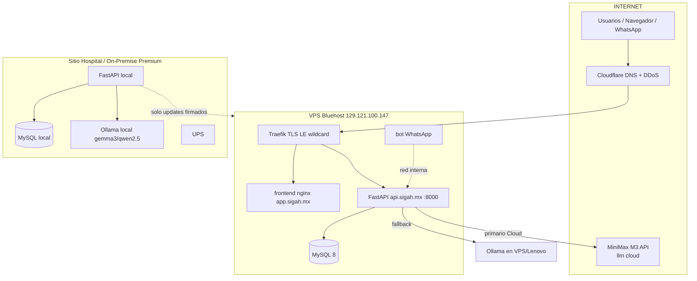

# SIGAH — Plan de Despliegue Web Seguro, Dominio Propio y Topología 24/7

> Documento de arquitectura. Dos ediciones de producto (Cloud Plan A / On-Premise Premium).
> Estado de infra verificado contra el repo (`docker-compose.yml`, `config.py`, `auth/jwt_handler.py`, `routes/openclaw.py`, `services/*`).
> Fecha: 2026-06-01.

---

## TL;DR Ejecutivo

1. **Dominio**: comprar `sigah.mx` (imagen de marca, recomendado) o `sigah.com.mx` (más barato) y, en paralelo, **delegar el DNS a Cloudflare** (gratis). Costo realista: **~$600–900 MXN/año** el dominio. Cloudflare aporta DNS rápido, protección DDoS y, sobre todo, el token para emitir **certificados wildcard** con DNS-01.
2. **Estructura de subdominios**: `app.sigah.mx` (frontend), `api.sigah.mx` (backend FastAPI), `panel.sigah.mx` (admin), `www`/raíz → redirige a `app`. Migración desde `*.sslip.io` **sin downtime** añadiendo los nuevos hosts a los labels de Traefik *antes* de retirar los viejos (regla crítica: todos los hosts deben estar en los labels o Traefik responde 502).
3. **TLS + seguridad**: Traefik con **Let's Encrypt DNS-01 (Cloudflare)** → wildcard `*.sigah.mx`, redirección 80→443 (ya existe el middleware `sigah-redirect`), **HSTS + headers de seguridad + rate limiting** vía middlewares Traefik. Hardening JWT: secreto fuerte rotable, refresh tokens con revocación, expiración corta del access token, **2FA TOTP para rol CEO/admin**. Cerrar `/openclaw/*` también a nivel Traefik (hoy solo lo bloquea nginx interno).
4. **Topología 24/7 + 2 ediciones**: patrón **circuit breaker** en el backend para enrutar IA. *Cloud*: MiniMax M3 como primario, **fallback a Ollama local** si la nube no responde (mismo patrón que ya existe en OCR PaddleOCR→Gemini). *On-Premise Premium*: **100% local**, los datos nunca salen del hospital; la VPS solo entrega actualizaciones de software firmadas. UPS + `restart: always` + healthchecks garantizan reinicio limpio tras corte de luz.
5. **Alta disponibilidad**: `restart: always` (ya configurado), healthchecks (ya configurados), backups MySQL diarios con retención y prueba de restore, monitoreo vía `/api/monitor/status` + alerta, y un runbook corto de recuperación.
6. **Plan por fases**: F1 Dominio+TLS → F2 Hardening Auth → F3 Failover IA (circuit breaker) → F4 HA/Backups/Monitoreo → F5 Edición On-Premise empaquetada. Cada fase con criterios de hecho medibles.

---

## 0. Estado actual verificado (línea base)

| Componente | Estado en el repo | Observación |
|---|---|---|
| Reverse proxy | Traefik con `certresolver=challenger`, entrypoints `web`/`websecure` | Hosts hoy = `sigab.129-121-100-147.sslip.io`, `sigah.…`, IP cruda |
| Redirección 80→443 | Middleware `sigah-redirect.redirectscheme` (permanent=true) | Ya existe, reutilizable |
| Backend | FastAPI :8000, healthcheck `/health`, JWT HS256 | `config.py`: `ACCESS_TTL_MIN=60`, `REFRESH_TTL_DAYS=7` |
| Auth | `auth/jwt_handler.py` access+refresh, multi-tenant `tenant_id`; bot vía `BOT_API_KEYS` → JWT efímero 24h | Falta: revocación de refresh, rotación de secreto, 2FA |
| IA local | Ollama `:11434` (`gemma_service.py`), modelos gemma3/qwen2.5 | Cliente httpx con timeout 120s/connect 5s |
| IA cloud | OCR: PaddleOCR local → **fallback Gemini** (`routes/ocr.py`) | **Patrón de failover ya existe** y es replicable para el copilot |
| OpenClaw/bot | `routes/openclaw.py`: bloqueado solo por nginx interno; endpoints "EXENTO-BOT" sin JWT | Riesgo: cerrar también en Traefik |
| Restart/health | `restart: always` + healthchecks en mysql/backend/bot | Sólido; falta política de backups y monitoreo activo |
| Monitoreo | `/api/monitor/status` (cpu, ram, disco, latencia interna) | Existe; falta scraping/alerta externa |
| MiniMax M3 | No referenciado aún en el código | A integrar en F3 |

**Regla operativa crítica (documentar en runbook):** si el daemon Docker se reinicia, el socket de Traefik queda *stale* → `docker restart traefik`. Y **todos** los hosts deben aparecer en los labels o se obtiene 502.

---

## 1. Dominio y DNS

### 1.1 Opciones de registrador (.mx / .com.mx)

| Registrador | `.mx` (anual aprox.) | `.com.mx` (anual aprox.) | Notas |
|---|---|---|---|
| **NIC México (Registry .MX)** | ~$500–650 MXN | ~$200–350 MXN | Operador oficial del ccTLD; renovación estable, sin sorpresas. |
| **Akky** (registrador acreditado MX) | ~$450–630 MXN (con promos 30% jun-2026) | ~$200–300 MXN | El más usado en MX, soporte en español, panel sencillo. |
| **GoDaddy MX** | ~$445 MXN | ~$185–250 MXN | Barato el primer año, ojo con renovación más cara. |
| **Cloudflare Registrar** | **No soporta `.mx` / `.com.mx`** | No | Cloudflare Registrar solo vende TLDs soportados (no el ccTLD `.mx`). Útil solo para `.com`. |
| Neubox / SoloWeb / otros | ~$600–630 MXN | ~$200 MXN | Revendedores; precio similar. |

**Recomendación:**
- Comprar **`sigah.mx`** en **Akky o NIC México** (marca premium para vender). Si el presupuesto manda, `sigah.com.mx` es válido y más barato.
- Reservar también `sigah.com.mx` defensivamente si el budget lo permite (~$250 MXN extra).
- **Delegar el DNS a Cloudflare (plan Free)**: aunque `.mx` no se *registra* en Cloudflare, sí se puede **apuntar los nameservers** del dominio a Cloudflare desde el panel de Akky/NIC. Esto habilita DNS rápido, proxy/DDoS opcional y el **API Token para DNS-01** (clave para el wildcard TLS de la sección 2).

> Costo total realista año 1: **dominio ~$600–900 MXN + Cloudflare $0**. El VPS Bluehost ya está pagado.

### 1.2 Pasos para apuntar DNS a la VPS (IP `129.121.100.147`)

Opción recomendada (Cloudflare como DNS):
1. En Akky/NIC: cambiar los **nameservers** del dominio a los que Cloudflare asigne (`xxx.ns.cloudflare.com`).
2. En Cloudflare → DNS, crear los registros:

| Tipo | Nombre | Valor | Proxy |
|---|---|---|---|
| A | `@` (sigah.mx) | `129.121.100.147` | DNS only (gris) al inicio |
| A | `app` | `129.121.100.147` | DNS only |
| A | `api` | `129.121.100.147` | DNS only |
| A | `panel` | `129.121.100.147` | DNS only |
| CNAME | `www` | `sigah.mx` | DNS only |

3. **Importante para DNS-01**: mientras se emiten certificados, dejar los registros en **"DNS only" (nube gris)**. Una vez TLS estable, se puede activar el proxy naranja (DDoS/cache) en `app`/`www`, pero **dejar `api` en DNS only** para no romper SSE/streaming ni WebSockets del bot/copilot, salvo configuración fina.
4. Crear un **API Token de Cloudflare** con permiso `Zone:DNS:Edit` solo para la zona `sigah.mx` (se usa en Traefik para el reto DNS-01).

> Alternativa sin Cloudflare (DNS en Akky): crear los mismos registros A directos a la IP y usar **HTTP-01** en Traefik (más simple, pero **sin wildcard**: hay que listar cada subdominio).

### 1.3 Estructura de subdominios propuesta

```
sigah.mx           → 301 → app.sigah.mx (landing/portal o app)
www.sigah.mx       → 301 → app.sigah.mx
app.sigah.mx       → frontend nginx (SIGAB SPA)
api.sigah.mx       → backend FastAPI (/api, /static, /health, /docs)
panel.sigah.mx     → panel admin / monitor (acceso restringido + 2FA)
```

### 1.4 Migración de `*.sslip.io` → dominio real **sin downtime**

Estrategia: **añadir, validar, luego retirar** (los hosts viejos y nuevos coexisten en los labels).

1. **Añadir** los nuevos `Host(...)` a los labels existentes, conservando los `sslip.io` (regla: todos los hosts en el mismo label o 502). Ejemplo para el router del backend:

```yaml
- "traefik.http.routers.sigah-api-s.rule=(Host(`sigab.129-121-100-147.sslip.io`) || Host(`sigah.129-121-100-147.sslip.io`) || Host(`api.sigah.mx`)) && (PathPrefix(`/api`) || PathPrefix(`/static`) || PathPrefix(`/health`) || PathPrefix(`/docs`))"
```

   Y para el frontend, añadir `Host(\`app.sigah.mx\`)` y `Host(\`www.sigah.mx\`)`.
2. `docker compose up -d` (recrea solo los contenedores con labels nuevos). Traefik pide el certificado del nuevo dominio automáticamente.
3. **Validar** `https://api.sigah.mx/health` y `https://app.sigah.mx` antes de tocar nada más.
4. Actualizar variables de entorno del backend: `SIGAH_PUBLIC_BASE_URL=https://app.sigah.mx` y `SIGAH_CORS_EXTRA=https://app.sigah.mx,https://panel.sigah.mx` (necesario para QRs y CORS).
5. Cuando todo el tráfico llegue por el dominio real, **retirar** los `Host(...sslip.io)` de los labels en un commit posterior (git pull en VPS → recrear). Mantener `sslip.io` ~1–2 semanas como red de seguridad.
6. Si tras recrear hay 502 → `docker restart traefik` (socket stale).

---

## 2. TLS + Seguridad

### 2.1 Emisión de certificados Let's Encrypt

**Recomendado: DNS-01 con Cloudflare → wildcard `*.sigah.mx`** (un solo cert cubre app/api/panel/www; no hace falta abrir el puerto 80 al reto).

`traefik.yml` (estático), bloque de resolver:
```yaml
certificatesResolvers:
  challenger:
    acme:
      email: djpiyama123@gmail.com
      storage: /letsencrypt/acme.json     # chmod 600, en volumen persistente
      dnsChallenge:
        provider: cloudflare
        resolvers: ["1.1.1.1:53", "8.8.8.8:53"]
```
Variables de entorno del contenedor Traefik:
```
CF_DNS_API_TOKEN=<token Zone:DNS:Edit de sigah.mx>
```
Solicitar el wildcard en los labels (un router con `tls.domains`):
```yaml
- "traefik.http.routers.sigah-fe-s.tls.certresolver=challenger"
- "traefik.http.routers.sigah-fe-s.tls.domains[0].main=sigah.mx"
- "traefik.http.routers.sigah-fe-s.tls.domains[0].sans=*.sigah.mx"
```

> **Alternativa HTTP-01** (sin Cloudflare): mantener `certresolver=challenger` con `httpChallenge` en el entrypoint `web`. Funciona, pero **sin wildcard** (un cert por subdominio) y requiere el puerto 80 abierto. Para empezar rápido es aceptable.

Renovación: Traefik renueva solo cuando faltan <30 días. `acme.json` debe persistir en volumen (si se borra, se re-emite y se puede topar con rate limits de Let's Encrypt → usar staging para pruebas).

### 2.2 Redirección 80→443

Ya existe el middleware `sigah-redirect` (`redirectscheme.scheme=https`, `permanent=true`). Aplicarlo en **todos** los routers `web`. Mantener.

### 2.3 HSTS + headers de seguridad (middleware Traefik)

```yaml
- "traefik.http.middlewares.sec-headers.headers.stsSeconds=31536000"
- "traefik.http.middlewares.sec-headers.headers.stsIncludeSubdomains=true"
- "traefik.http.middlewares.sec-headers.headers.stsPreload=true"
- "traefik.http.middlewares.sec-headers.headers.forceSTSHeader=true"
- "traefik.http.middlewares.sec-headers.headers.contentTypeNosniff=true"
- "traefik.http.middlewares.sec-headers.headers.browserXssFilter=true"
- "traefik.http.middlewares.sec-headers.headers.frameDeny=true"
- "traefik.http.middlewares.sec-headers.headers.referrerPolicy=strict-origin-when-cross-origin"
- "traefik.http.middlewares.sec-headers.headers.customResponseHeaders.X-Powered-By="
```
> Cuidado: si más adelante se activa el proxy naranja de Cloudflare, configurar SSL/TLS en Cloudflare como **Full (strict)** para no chocar con HSTS.

### 2.4 Rate limiting (middleware Traefik)

```yaml
- "traefik.http.middlewares.ratelimit.ratelimit.average=100"
- "traefik.http.middlewares.ratelimit.ratelimit.burst=50"
- "traefik.http.middlewares.ratelimit.ratelimit.period=1m"
```
Aplicar más estricto en `api.sigah.mx` (login/auth) y `panel.sigah.mx`. Encadenar middlewares: `sec-headers,ratelimit` en cada router `-s`.

### 2.5 Cerrar `/openclaw/*` a nivel Traefik (no solo nginx)

Hoy `routes/openclaw.py` está protegido **solo por nginx interno**; varios endpoints "EXENTO-BOT" no exigen JWT. Defensa en profundidad:
- Añadir un middleware Traefik que **bloquee `/api/openclaw`** desde fuera (`ipWhiteList` a la red Tailscale 100.x / LAN, o un router que devuelva 403 para ese PathPrefix en el entrypoint público).
- El bot habla con el backend por la **red interna Docker** (`http://backend:8000`), no por el dominio público → no necesita exposición externa.
- Completar la migración a JWT (Fase 3 del propio módulo) para que ningún endpoint quede sin `Depends(get_current_tenant)`.

### 2.6 Hardening de la autenticación JWT

| Medida | Estado hoy | Acción |
|---|---|---|
| Secreto fuerte | `SIGAH_JWT_SECRET` con default dev | Generar `secrets.token_urlsafe(48)`, guardar en `.env`/secret manager; **nunca** el default en prod |
| Rotación de secreto | No | Soportar **2 secretos** (actual + previo) para validar durante rotación; rotar trimestralmente |
| Access token corto | 60 min | Bajar a **15–30 min** (`SIGAH_ACCESS_TTL_MIN`) |
| Refresh token | 7 días, sin revocación | Persistir `jti`/hash en tabla `refresh_tokens`; **rotación en cada uso** + lista de revocación; logout invalida |
| 2FA admin/CEO | No | **TOTP (pyotp)** obligatorio para rol `admin`/`ceo`; QR de enrolamiento + códigos de respaldo |
| Algoritmo | HS256 (simétrico) | Aceptable para mono-servicio; si se multiplica servicios, migrar a RS256 (clave pública/privada) |
| Brute force login | Rate limit solo en Traefik | Añadir **lockout** por usuario tras N intentos + auditoría (`audit_service.py` ya existe) |
| Bot keys | `BOT_API_KEYS` JSON, JWT 24h | Rotar claves por hospital; almacenar como secreto, no en git |

---

## 3. Topología 24/7 + Dos Ediciones

### 3.1 Diagrama general (texto)



### 3.2 Edición **SIGAH Cloud / Plan A** (cerebro IA en la nube, MiniMax M3)

- Flujo IA del copilot: **MiniMax M3 (primario) → Ollama local (fallback)**.
- Reutiliza el patrón ya probado en OCR (`routes/ocr.py`: PaddleOCR local → fallback Gemini). El copilot (`services/gemma_service.py`) hoy va directo a Ollama; se antepone el cliente cloud.
- MiniMax M3 expone endpoint **OpenAI-compatible** → integrar con cliente httpx/OpenAI SDK apuntando al base URL de M3 y `MINIMAX_API_KEY`. Costos de referencia (jun-2026): entrada ~$0.30–0.60/M tokens, salida ~$1.20/M (varía por proveedor/promoción).

### 3.3 Edición **SIGAH On-Premise Premium** (100% local, datos no salen)

- **Todo corre dentro del hospital**: MySQL local + FastAPI local + Ollama local en máquina dedicada (hoy Lenovo ThinkCentre; a futuro NVIDIA GB10 para modelos grandes).
- **Sin salida de datos clínicos**: el único tráfico saliente permitido es **actualización de software firmada** (git pull desde un mirror, o paquete versionado) y telemetría opcional anónima. Firewall: egress denegado salvo el endpoint de updates.
- **Degradación elegante**: si se cae la nube o internet, el sistema sigue 100% operativo con LLM local + datos locales. Es el diferenciador premium.

### 3.4 Patrón Circuit Breaker / Failover IA

Servicio nuevo `services/ai_router.py` que decide a dónde mandar cada inferencia:

```python
# Pseudocódigo del enrutador IA con circuit breaker
class AIRouter:
    # estados: CLOSED (usa cloud) / OPEN (cloud caído, usa local) / HALF_OPEN (probando)
    FAIL_THRESHOLD = 3        # fallos consecutivos para abrir
    COOLDOWN_S = 60           # tiempo antes de reintentar cloud
    CLOUD_TIMEOUT_S = 8       # si M3 no responde en 8s -> fallback

    async def chat(self, prompt, ctx, edition):
        if edition == "on_premise":
            return await ollama_chat(prompt, ctx)        # nunca sale a la nube
        if self.state == "OPEN" and not self._cooldown_done():
            return await ollama_chat(prompt, ctx)        # circuito abierto -> local
        try:
            r = await minimax_chat(prompt, ctx, timeout=self.CLOUD_TIMEOUT_S)
            self._record_success()                       # cierra circuito
            return r
        except (Timeout, HTTPError, ConnError):
            self._record_failure()                       # abre tras N fallos
            return await ollama_chat(prompt, ctx)        # FALLBACK local
```

Reglas:
- **Cloud edition**: `CLOSED` por defecto; tras 3 fallos/timeout consecutivos pasa a `OPEN` (todo a Ollama local) durante 60s, luego `HALF_OPEN` (1 prueba). Logear cada transición y exponer el estado en `/api/monitor/status`.
- **On-Premise edition**: el router **ni intenta** la nube (corto-circuito por configuración `SIGAH_EDITION=on_premise`).
- Variables nuevas: `SIGAH_EDITION` (`cloud`|`on_premise`), `SIGAH_MINIMAX_BASE_URL`, `SIGAH_MINIMAX_API_KEY`, `SIGAH_AI_CLOUD_TIMEOUT_S`.

### 3.5 ¿Qué pasa si se va la luz?

- **UPS** (ya presente en el Lenovo) sostiene el servidor durante el corte y permite apagado limpio si se prolonga.
- Todos los servicios tienen `restart: always` → al volver la energía, Docker levanta el stack solo.
- **Orden de arranque garantizado** por `depends_on` + healthchecks: MySQL `healthy` antes de backend, backend `healthy` antes de bot.
- Tras reinicio del daemon: verificar Traefik (`docker restart traefik` si hay 502 por socket stale).
- En **On-Premise Premium**, aunque caiga internet/nube, el sitio sigue operando con datos + LLM locales.

### 3.6 ¿Qué pasa si se cae la nube (MiniMax)?

- Circuit breaker abre el circuito → copilot responde con Ollama local (menor calidad pero funcional).
- OCR ya tiene su propio fallback (Gemini cloud); si Gemini cae, PaddleOCR local cubre el caso base.
- El frontend muestra un badge "IA en modo local" (leer estado desde `/api/monitor/status`).

---

## 4. Alta Disponibilidad

### 4.1 Restart policies y healthchecks (ya presentes — auditar y completar)

- `restart: always` en mysql/backend/bot/frontend ✔ (añadir a `frontend` si falta y a Traefik).
- Healthchecks: MySQL `mysqladmin ping`, backend `/health`, bot `/health` ✔. Añadir healthcheck a `frontend` (curl a `/`).
- Definir `stop_grace_period` razonable en MySQL para evitar corrupción en apagados.

### 4.2 Backups MySQL

Existe carpeta `SIGAB-backups`. Formalizar:

```bash
# cron diario 02:00 en la VPS (y en cada nodo On-Premise)
docker exec sigah-mysql sh -c \
  'mysqldump --single-transaction --routines --triggers \
   -u"$MYSQL_USER" -p"$MYSQL_PASSWORD" sigah' \
  | gzip > /opt/SIGAB-backups/sigah_$(date +\%F).sql.gz
# retención 14 días
find /opt/SIGAB-backups -name 'sigah_*.sql.gz' -mtime +14 -delete
```
- **Regla 3-2-1**: copia local + copia en otro nodo (Lenovo vía Syncthing/Tailscale) + copia cifrada off-site.
- **Probar el restore mensualmente** (un backup no probado no es un backup).
- También respaldar volúmenes: `sigab_uploads` (fotos/PDFs) y `sigab_bot_auth` (sesión WhatsApp — perderlo obliga a re-escanear QR).

### 4.3 Monitoreo

- `/api/monitor/status` ya entrega cpu/ram/disco/latencia + (añadir) estado del circuit breaker IA.
- Existe `sigab-monitor`: que haga *scraping* del endpoint cada 30–60s y **alerte** (WhatsApp vía el bot, o email vía `mail_service.py`) ante: servicio caído, disco >85%, cert por expirar <15 días, MySQL no `healthy`, circuito IA `OPEN` >5 min.
- Healthcheck externo gratuito (UptimeRobot) sobre `https://api.sigah.mx/health` para avisar si la VPS entera cae.

### 4.4 Runbook breve de recuperación

```
SÍNTOMA → ACCIÓN
─────────────────────────────────────────────────────────────
502 tras reinicio / deploy   → docker restart traefik (socket stale)
                               verificar que TODOS los Host(...) están en labels
Cert no emite (DNS-01)       → revisar CF_DNS_API_TOKEN; logs traefik;
                               probar resolver staging; verificar acme.json (chmod 600)
Backend unhealthy            → docker logs sigah-backend; ¿MySQL healthy?;
                               docker compose up -d --force-recreate backend
MySQL caído / corrupto       → restaurar último backup:
                               gunzip < sigah_YYYY-MM-DD.sql.gz | docker exec -i sigah-mysql mysql -u.. -p.. sigah
Bot WhatsApp desconectado    → revisar volumen sigab_bot_auth; re-escanear QR si se perdió
Corte de luz                 → UPS sostiene; al volver, Docker auto-levanta;
                               validar /health y /api/monitor/status
Nube IA caída                → circuit breaker abre solo; confirmar fallback Ollama;
                               badge "IA local" visible
Despliegue nuevo (réplicas)  → git pull en nodo → docker compose up -d → smoke test /health
```

---

## 5. Plan por Fases (priorizado, accionable)

### Fase 1 — Dominio + TLS (1–2 días) — *base profesional*
- [ ] Comprar `sigah.mx` (Akky/NIC) + reservar `sigah.com.mx`.
- [ ] Delegar NS a Cloudflare; crear A/CNAME (app/api/panel/www) en "DNS only".
- [ ] Crear API Token Cloudflare `Zone:DNS:Edit`.
- [ ] Configurar resolver DNS-01 en Traefik → wildcard `*.sigah.mx`.
- [ ] Añadir nuevos `Host(...)` a labels (sin quitar sslip.io); validar HTTPS.
- [ ] Actualizar `SIGAH_PUBLIC_BASE_URL` y `SIGAH_CORS_EXTRA`.
- **Hecho si:** `https://app.sigah.mx` y `https://api.sigah.mx/health` responden con cert válido y A+ en SSL Labs; redirección 80→443 funciona.

### Fase 2 — Hardening de Auth y Seguridad (2–3 días)
- [ ] Reemplazar `SIGAH_JWT_SECRET` por secreto fuerte; soportar 2 secretos para rotación.
- [ ] Access TTL → 15–30 min; refresh con `jti` + revocación + rotación en uso.
- [ ] 2FA TOTP para rol admin/ceo.
- [ ] Middlewares Traefik: `sec-headers` (HSTS) + `ratelimit` en api/panel.
- [ ] Bloquear `/api/openclaw` desde el exterior (ipWhiteList Tailscale/LAN); completar migración JWT del módulo.
- [ ] Lockout por intentos de login + auditoría.
- **Hecho si:** ningún endpoint sensible accesible sin JWT desde internet; HSTS y rate limit verificados; 2FA exigido al admin; rotación de secreto probada sin tirar sesiones válidas.

### Fase 3 — Failover IA / Circuit Breaker (3–4 días)
- [ ] `services/ai_router.py` con estados CLOSED/OPEN/HALF_OPEN.
- [ ] Integrar MiniMax M3 (cliente OpenAI-compatible) como primario en edición Cloud.
- [ ] Fallback automático a Ollama local; `SIGAH_EDITION` corto-circuita en On-Premise.
- [ ] Exponer estado del breaker en `/api/monitor/status` + badge en frontend.
- **Hecho si:** apagando MiniMax (o cortando internet) el copilot sigue respondiendo vía Ollama en <10s; en `on_premise` no hay tráfico saliente a la nube (verificado con captura/firewall).

### Fase 4 — HA, Backups y Monitoreo (2–3 días)
- [ ] Cron backup MySQL diario + retención 14d + copia a Lenovo (Syncthing) + off-site cifrado.
- [ ] Backup de volúmenes `sigab_uploads` y `sigab_bot_auth`.
- [ ] `sigab-monitor` con alertas (disco/servicio/cert/IA) vía bot o email.
- [ ] UptimeRobot externo sobre `/health`.
- [ ] Healthcheck a `frontend`; auditar restart policies.
- **Hecho si:** restore de prueba exitoso; alerta dispara al simular disco lleno o servicio caído; monitor externo notifica caída de VPS.

### Fase 5 — Empaquetar Edición On-Premise Premium (3–5 días)
- [ ] `docker-compose.onprem.yml` (sin dependencias cloud, Ollama incluido, egress restringido).
- [ ] Canal de actualización firmado (mirror git/paquete versionado), egress allowlist solo a updates.
- [ ] Documento de instalación en sitio + runbook de corte de luz/internet.
- **Hecho si:** instalación reproducible en una máquina aislada; opera con internet desconectado; updates aplicables sin exponer datos clínicos.

---

## Anexo — Tabla de costos (resumen, MXN/año)

| Concepto | Costo aprox. | Recurrencia |
|---|---|---|
| Dominio `sigah.mx` | $600–900 | anual |
| Dominio `sigah.com.mx` (defensivo, opcional) | $250 | anual |
| Cloudflare DNS (Free) | $0 | — |
| Let's Encrypt (TLS) | $0 | auto-renovación |
| VPS Bluehost | (ya contratado) | — |
| MiniMax M3 (solo edición Cloud, por uso) | ~$0.30–0.60/M in, ~$1.20/M out tokens | variable |
| UptimeRobot (Free) | $0 | — |

> Cifras de dominios en MXN son aproximadas (jun-2026) y dependen de promociones del registrador; verificar al comprar.
