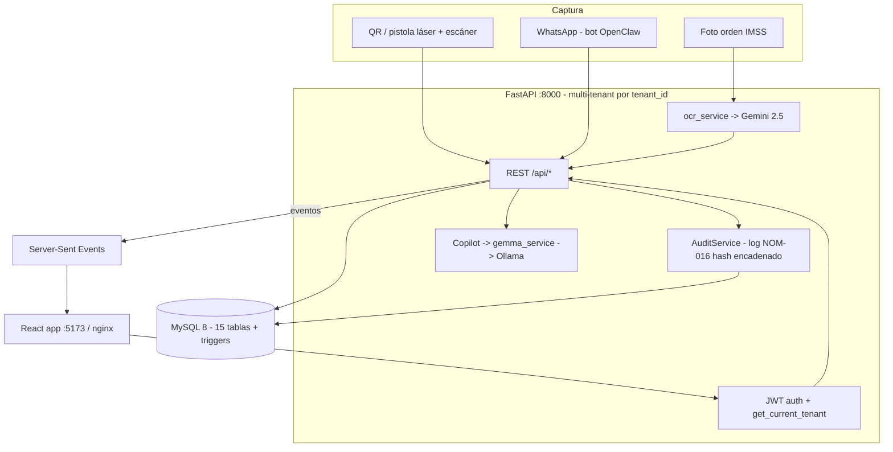

# SIGAH — Auditoría del ecosistema y flujo de datos

> Verificado leyendo el repo (`SIGAB/`, que ES el monorepo SIGAH en GitHub `djpiyama123-droid/SIGAH`).

## 1. Nomenclatura (fuente de confusión frecuente)
- **SIGAH** = la **empresa** (marca paraguas, Industria 4.0 para hospitales). También el **repo/monorepo**.
- **SIGAB** = la **aplicación** de gestión de activos biomédicos (el producto). Mnemotecnia: *SIGAH contiene a SIGAB*.
- El directorio local `SIGAB/` es el monorepo; el directorio raíz `SIGAH/` (Vite suelto) es código separado/landing.

## 2. Componentes del ecosistema

| Componente | Carpeta | Stack | Rol | Despliegue |
|---|---|---|---|---|
| Backend API | `sigab-backend/` | FastAPI + Python 3.12 + MySQL 8 (SQLModel async) | 26 módulos REST (`/api/*`), JWT multi-tenant | VPS Docker (8000) |
| Frontend app | `sigab-frontend/` | React 19 + Vite + Tailwind | App hospitalaria (19 páginas) | nginx:alpine estático |
| Portal/WebPanel | `portal-sigah/` | React + TS | Portal comercial + panel CEO/Dev | `panel.…sslip.io` |
| Bot WhatsApp | `sigab-bot/` | Node + Baileys/Twilio | Ingesta por mensajería (OpenClaw) | VPS Docker |
| Monitor | `sigab-monitor/` | — | Healthchecks / `/api/monitor/status` | — |
| Base de datos | `database/` | MySQL 8 (~15 tablas + triggers) | Datos + audit trail NOM-016 | VPS Docker |
| IA local | (Ollama externo) | Gemma 3/Qwen 2.5 | Copilot + razonamiento | host:11434 |

## 3. Módulos backend (26) — fuente: `CLAUDE.md`
Auth JWT, Equipos, Órdenes, Preventivos, Dashboard KPIs, Alertas, Tecnovigilancia NOM-240, **Copilot IA**, Trazabilidad, Reportes PDF/Excel, Auditoría NOM-016, Checklists, Almacén, Metrología, Capacitaciones, Reservas, Formatos IMSS, **OCR/Visión**, **OpenClaw (agente IA)**, QR/Inventario, Admin SuperAdmin, Eventos SSE, Twilio WhatsApp, Monitor, Tokens API, Cerebro/Claude Code.

## 4. Flujo de datos (estado actual)



**Aislamiento multi-tenant:** cada hospital = un `tenant_id` (FK a `hospitales`). `get_current_tenant` lo extrae del JWT; nunca del body (anti-forja, probado en `test_tenant_isolation.py`). El bot obtiene JWT efímero por hospital vía `BOT_API_KEYS`.

**Audit trail NOM-016:** `AuditService.log_event` escribe en `log_auditoria_nom016` con **hash SHA-256 encadenado** (cada registro encadena el hash del anterior → inmutabilidad). ⚠️ Hoy abre su propia sesión (ver doc 04, impacto en tests).

## 5. Infraestructura (3 nodos + GitHub fuente de verdad)
```
GitHub djpiyama123-droid/SIGAH  ← única fuente de verdad
   ├─ ASUS TUF A16 (WSL2)      → desarrollo
   ├─ ThinkCentre M720q (Ubuntu) → 24/7, Claude Code, Tailscale, UPS (futuro: GB10 NVIDIA)
   └─ VPS Bluehost (129.121.100.147) → producción Docker + Traefik (dominios sslip.io)
Red Tailscale (100.x) + Syncthing (lo no-versionado: memorias, secretos, vault)
```

## 6. Dónde se "conecta" MiniMax al ecosistema
1. **Desarrollo (agentes):** redirigir `ANTHROPIC_BASE_URL` de Claude Code/OpenCode a `https://api.minimax.io/anthropic` (ver doc 02). Abarata construir SIGAH ~10-24x.
2. **Runtime (cerebro Cloud):** nuevo `llm_service` que enruta Copilot/OpenClaw a M3 vía API, con fallback a Ollama local (ver doc 05).
3. **Multimodal:** M3 puede complementar/reemplazar Gemini en OCR.

## 7. Hallazgos / riesgos del ecosistema
- ✅ Arquitectura multi-tenant sólida y probada (aislamiento).
- ⚠️ **Sin CI de tests** → el drift de schema (tenant_id) pasó inadvertido (doc 04).
- ⚠️ `AuditService` con sesión propia rompe atomicidad en tests (doc 04).
- ⚠️ Muchos cambios **sin commitear** y **12 worktrees** activos → riesgo de divergencia. Conviene consolidar antes de la integración MiniMax.
- ⚠️ Endpoints `/openclaw/*` protegidos solo por nginx interno (no JWT en algunos) → endurecer antes de exponer dominio público (doc 03).
- ⚠️ Enviar PHI a la nube MiniMax vs sello "on-premise" → decisión de cumplimiento (docs 01/05).
